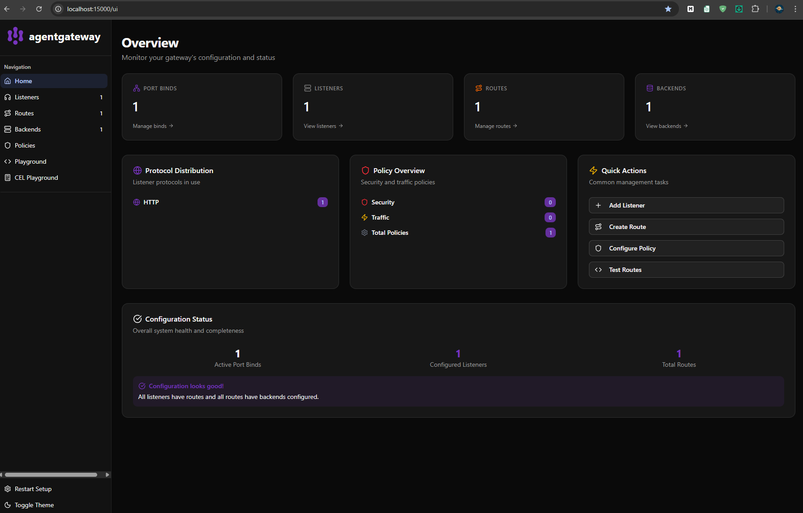
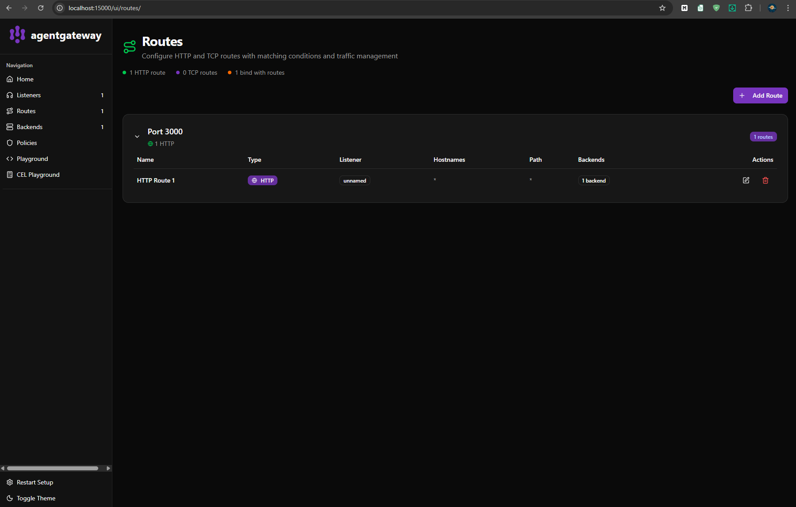
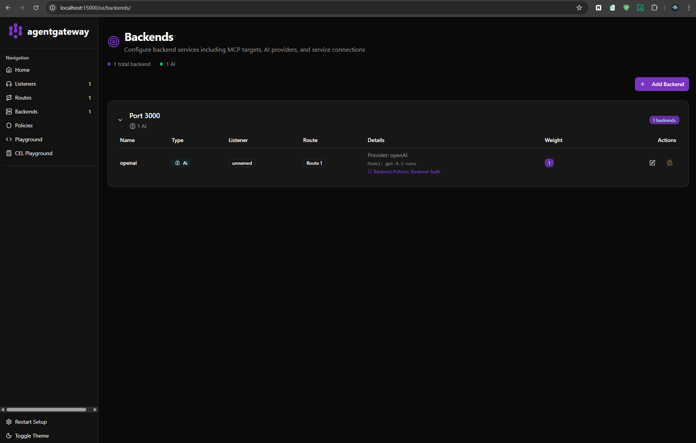
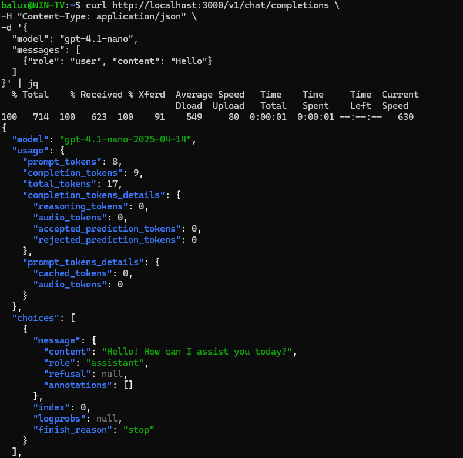

# Lab-1 Basic Agentic Infrastructure

## 1 Install agentgateway

curl -sL https://agentgateway.dev/install | bash

Check version:

agentgateway --version

---

## 2 LLM Provider

Provider: OpenAI

Environment variable:

export OPENAI_API_KEY=***

---

## 3 Configuration

Used config.yaml to configure OpenAI provider.

---

## 4 Run gateway

agentgateway -f config.yaml

Gateway UI:

http://localhost:15000/ui/

---

## 5 Test LLM

curl http://localhost:3000/v1/chat/completions \
-H "Content-Type: application/json" \
-d '{
"model": "gpt-4.1-nano",
"messages": [{"role": "user", "content": "Hello"}]
}'

---

## Features tested

Backends  
Policies  
Routes
---

# Lab-1 Basic Agentic Infrastructure

## Gateway UI

---

## Routes Configuration

---

## Backends

---

## LLM Test Response

